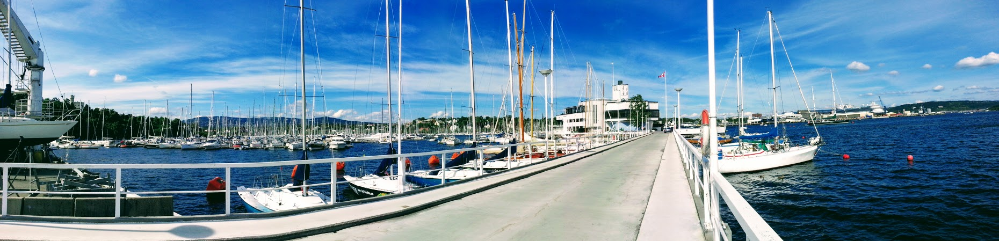

```{r setup, include=FALSE}
knitr::opts_chunk$set(echo = TRUE)
```

<br>

<!--html_preserve-->
<div class="jumbotron">
  <h1 class="display-3">Hello!</h1>
  <p class="lead">Welcome to my personal website. I am delighted to see you here visiting my pages.</p>
  <p>In this place, I host my Curriculum Vitae and some other stuff.</p>
  <p>Feel free to wander around my pages.</p>
  <p>See you!</p>
  <p>AH Uyekita.</p><br>
  <p class="lead">
    <a class="btn btn-primary btn-lg" href="cv.html" role="button">See my CV</a>
  </p>
</div>
<!--/html_preserve-->


<center><h1>Who Am I?</h1></center>

<div class = "row"><div class = "col-md-10">

<p style="text-align: justify; font-size: 1.2em;">I am an Electrical Engineer and I passionated in Data Science and Artificial Intelligence since I have started the very famous Data Science Specialization in Coursera. Sadly, I have interrupted my studies in 2016 to dive into a new area of work, running my own business. After an experience for two years as an entrepreneur, I decided to came back to my origins.</p>

<p style="text-align: justify; font-size: 1.2em;>Now, as a Data Scientist, I am open to a new challenge in my life.</p>

</div>

<div class = "row"><div class = "col-md-2">


</div>
</div>

<br>

<!--html_preserve-->
<div class="well">    
  <h3 class="margin">Data Science Projects</h3><br>
  <div class="row">
    <div class="col-sm-4">
      <p class="lead">Investigate a Dataset</p>
      <p>
         <span class="label label-warning">Python 3</span>
         <span class="label label-info">Markdown</span>
      </p>
      <p>In this Udacity's project, I have performed a Data Wrangling and Data Visualization about the Medical Appointments from Vitória City, Brazil. The dataset is hosted in Kaggle and has almost 100,000 medical records. You can read my conclusion about it reading the nbviewer.</p>
      <br>
      <a href="http://bit.ly/nd110_project_02" class="btn btn-primary" target="_blank">nbviewer</a>
    </div>
    <div class="col-sm-4"> 
      <p class="lead">Chinook</p>
      <p>
         <span class="label label-primary">SQL</span>
         <span class="label label-info">Markdown</span>
      </p>
      <p>This project is about the music preferences of a fictional company called Chinook, this database is available on Github for anyone to make your own study. All queries used to create graphics and to pose questions are available in the Mode Analytics platform.</p>
      <br>
      <a href="http://bit.ly/nd111_project_01" class="btn btn-primary" target="_blank">Mode Analytics</a>
    </div>
    <div class="col-sm-4"> 
      <p class="lead">Wrangle and Analyze Data</p>
      <p>
         <span class="label label-success">R</span>
         <span class="label label-warning">Python 3</span>
         <span class="label label-info">Markdown</span>
      </p>
      <p>The WeRateDogs™ is a Twitter account which gives a rating for dogs, I have used the Twitter API to gather information about the tweets made from all users. Later, I have posed some questions and I have answered using the available data. The document is available in nbviewer.</p>
      <br>
      <a href="http://bit.ly/nd111_project_02" class="btn btn-primary" target="_blank">nbviewer</a>
    </div>
  </div>
  <hr>
  <div class="row">
    <div class="col-sm-4">
      <p class="lead">Analyze A/B Test Results</p>
      <p>
         <span class="label label-warning">Python 3</span>
         <span class="label label-info">Markdown</span>
      </p>      
      <p>The A/B Testing is a powerful tool to evaluate if a new version has better performance than the older one. In this project, I have made several hypothesis tests to ensure better decision making. For this specific project, it was convenient to keep the older version of the website.</p>
      <br>
      <a href="http://bit.ly/nd111_project_03" class="btn btn-primary" target="_blank">nbviewer</a>
    </div>
    <div class="col-sm-4"> 
      <p class="lead">Building a New Geom</p>
      <p>
         <span class="label label-success">R</span>
         <span class="label label-info">Markdown</span>
      </p>     
      <p>This assignment from Coursera aims to create a new "function" to be used to draw a different kind of graphic. The new so-called geom_hurricane will use the ggplot package as the bedrock for its advanced geom, which will use to plot wind speed and area covered.</p>
      <br>
      <a href="http://bit.ly/2HjiWIS" class="btn btn-primary" target="_blank">RPubs</a>
    </div>
    <div class="col-sm-4"> 
      <p class="lead">Creating an R Package</p>
      <p>
         <span class="label label-success">R</span>
         <span class="label label-info">Markdown</span>
      </p>        
      <p>In this project, I have created a new package and I have disclosed it in Github, this package also receives the Travis CI badge which means it could be run in any computer. The package uses the US FARS data (Fatality Analysis Reporting System) as input.</p>
      <br>
      <a href="http://bit.ly/2VZhXRv" class="btn btn-primary" target="_blank">Github</a>
    </div>
  </div>
  <hr>
  <a href="#">Read more.</a>
</div>
<!--/html_preserve-->

<br>
<div>
<center><h1>Upcoming studies for 2019.</h1></center>
<ul>
<li><p style="text-align: justify; font-size: 1.3em;">Fishing the Data Science Foundations II;</p></li>
<li><p style="text-align: justify; font-size: 1.3em;">Start the Data Scientist Nanodegree.</p></li>
</ul>
</div>
<br>

<!--html_preserve-->
<div class="well">
  <h3 class="margin">Conference Papers</h3><br>
  <div class="row">
    <div class="col-sm-6">
      <p class="lead">MV Planning Approach Using Temporal Series, Billing Data of Medium Voltage Consumers and Substation Feeders Metering</p>
      <p>Based on billing data, DMS database, Feeders Loading Time series, etc. it was possible to build the short-term (action plan) and the long-term planning. This paper presents the methodology used by Daimon Engineering & Centrum Engineering Consortium to study CELESC’s Joinville Regional Medium Voltage Distribution System (MVDS).</p>
      <br>
      <a href="01-Publications/CIRED2015_0544_final.pdf" class="btn btn-primary" target="_blank">PDF</a>
    </div>
    <div class="col-sm-6">
      <p class="lead">Load Modeling Based on Field Survey of Electric Appliances Ownership and Consumption Habits</p>
      <p>This paper presents a methodology that characterizes the load profile of each electricity consumer (residential, industrial, commercial, rural, etc.), according to its daily load curves for each period (dawn, morning, afternoon and night), and has been based on field assessments of consumer habits and ownership of consumers' equipment appliances.</p>
      <br>
      <a href="01-Publications/CIRED2013_0884_final.pdf" class="btn btn-primary" target="_blank">PDF</a>
    </div>
  </div>
  <hr>
  <a href="#">Read more.</a>
</div>
<!--/html_preserve-->


